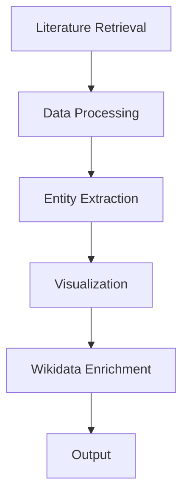

# Automated Literature Review & Biodiversity Data Extraction

[](https://www.python.org/) &nbsp; &nbsp; &nbsp; &nbsp;
[](https://colab.research.google.com/) &nbsp; &nbsp; &nbsp; &nbsp;
[]() &nbsp; &nbsp; &nbsp; &nbsp;
[](https://creativecommons.org/licenses/by/4.0/) 

## Overview
This repository contains a workflow focused on biodiversity data liberation.

A large portion of biodiversity knowledge (taxonomic, ecological, distributional) exists in scientific publications in non-machine-readable formats. This project demonstrates a practical approach to:

- Extract structured information from literature  
- Enable reuse of scientific knowledge  
- Support FAIR (Findable, Accessible, Interoperable, Reusable) data principles  

The workflow combines **open science tools** and **AI-assisted text analysis** for literature-driven knowledge extraction.


## Objective
- Extract and structure information from scientific publications  
- Enable analysis and reuse of literature data  
- Demonstrate a scalable pipeline for biodiversity and research data workflows  


## Tools Used
- **pygetpapers** – retrieval of scientific articles from Europe PMC (EPMC)  
- **amilib** – metadata processing and structuring  
- **docanalysis** – entity extraction (countries, diseases, drugs, etc.)  


## Workflow



### 1. Literature Retrieval
- Query Europe PMC (EPMC) using search terms  
- Retrieve article counts  
- Analyze temporal distribution of publications  
- Download recent articles (e.g., last 50)

### 2. Data Processing
- Generate structured summary tables  
- Analyze metadata within Colab  

### 3. Entity Extraction
Using `docanalysis`, extract entities such as:
- Countries  
- Diseases  
- Drugs  

From sections:
- Introduction  
- Results  
- Discussion  
- Conclusion  
- Full text  

### 4. Visualization
- Generate word clouds for extracted entities:
  - Countries  
  - Diseases  
  - Drugs  

### 5. Knowledge Enrichment
- Link extracted entities with **Wikidata**  
- Build connections between:
  - Publications  
  - Countries  
  - Diseases  
  - Drugs  

### 6. Output
- Save processed data and analysis locally  


## Context

This work was carried out to address:

> “How to systematically extract and reuse biodiversity data from scientific literature using open tools, AI methods, and FAIR data principles.”

The workflow reflects:
- Data extraction from publications  
- Transformation into structured knowledge  
- Reusability in research and digital systems  


## Setup

### 1. Get the Repository
- Click on **Code → Download ZIP** from this repository  
  **OR**
- Clone using Git:
```bash
git clone https://github.com/neelkumar01/Automated-Literature-Review-Using-Semantic-Toolkit.git
```

### 2. Extract Files (if ZIP)
If downloaded as ZIP, extract it

Locate the file: notebook.ipynb

Repository Structure
```bash
├── notebook.ipynb        # Main Colab notebook
├── outputs/              # Generated outputs
└── README.md
```

### 3. Open Google Colab:  
   https://colab.research.google.com/

### 4. Upload the notebook:
   - Click on **File → Upload Notebook**
   - Select `notebook.ipynb` from this repository  

### 5. Run the notebook:
   - Click **Runtime → Run all**
   - Or execute cells one by one using **Shift + Enter**

### 6. Provide your search query:
   - Enter your topic/keyword where prompted in the notebook  

### 7. View outputs:
   - Article retrieval results  
   - Summary tables  
   - Extracted entities (countries, diseases, drugs)  
   - Wordcloud visualizations  

### 8. Download results:
   - Outputs generated in the notebook can be saved locally  

### Notes
> - No manual setup required — all dependencies are handled inside the notebook  
> - Runtime may take a few minutes depending on the query and data size 

## Use Cases
- Literature review automation
- Biodiversity informatics workflows
- Research trend analysis
- Entity extraction from scientific text
- Knowledge graph / data enrichment pipelines

## License

This work is based on workshop content provided by semanticClimate and is licensed under:

CC BY (Creative Commons Attribution)

## References
- https://github.com/petermr/pygetpapers
- https://github.com/petermr/amilib
- https://github.com/petermr/docanalysis
